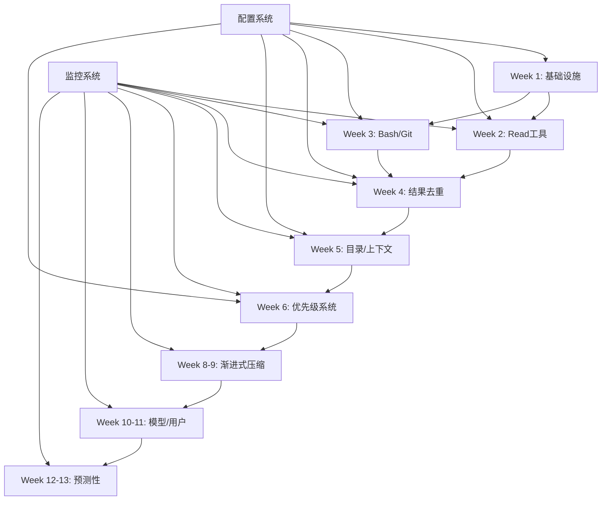

# 实施路线图

> Token 优化方案的具体实施计划，包含任务分解、依赖关系和里程碑

---

## 📋 项目概览

### 项目名称
Ola-cc Token 优化项目

### 项目目标
- **主要目标**: 实现 40-60% 的 token 节省
- **次要目标**: 提升工具执行效率，改善用户体验
- **技术目标**: 建立可扩展的 token 优化架构

### 项目周期
- **总工期**: 9-13 周
- **团队规模**: 2-3 人
- **开始时间**: 2026-05-26

---

## 🎯 里程碑

### Phase 1 基础优化完成 (Week 3)
- [ ] Read 工具智能截断实现
- [ ] Bash 输出流式处理实现
- [ ] Git 命令压缩实现
- [ ] 文件缓存机制实现
- [ ] 基础集成测试通过
- [ ] 性能基准测试通过

### Phase 2 中级优化完成 (Week 7)
- [ ] 工具结果去重实现
- [ ] 目录结构缓存实现
- [ ] 上下文智能分区实现
- [ ] 优先级内容保留实现
- [ ] 中级集成测试通过
- [ ] 用户反馈收集与调整

### Phase 3 高级优化完成 (Week 13)
- [ ] 渐进式压缩实现
- [ ] 模型特定优化实现
- [ ] 用户行为学习实现
- [ ] 预测性压缩实现
- [ ] 高级集成测试通过
- [ ] 最终验收测试通过

---

## 📅 详细任务分解

### Phase 1: 基础优化 (Week 1-3)

#### Week 1: 架构搭建
**任务 1.1**: 创建 token 优化基础设施
- [ ] 创建 `src/services/tokenOptimization/` 目录
- [ ] 设计核心接口和类型定义
- [ ] 实现配置管理系统
- [ ] 添加监控和日志框架

**任务 1.2**: 依赖环境准备
- [ ] 添加必要的性能监控库
- [ ] 配置测试框架
- [ ] 设置基准测试数据
- [ ] 实现简单的性能测试

**任务 1.3**: 设计文档完善
- [ ] 完善架构设计文档
- [ ] 编写 API 文档
- [ ] 制定编码规范
- [ ] 准备实施方案

#### Week 2: Read 工具优化
**任务 2.1**: Smart Truncation 实现
- [ ] 分析现有 FileReadTool 代码结构
- [ ] 实现智能截断算法
- [ ] 添加文件类型识别
- [ ] 实现缓存机制

```typescript
// 实现示例
export class SmartReadTruncator {
  async truncate(content: string, fileType: string, maxSize: number): string {
    // 1. 识别文件类型
    const type = this.detectFileType(fileType);
    
    // 2. 应用相应的截断策略
    switch (type) {
      case 'config':
        return this.keepConfigSignatures(content, maxSize);
      case 'test':
        return this.keepTestSignatures(content, maxSize);
      case 'source':
        return this.keepImportsAndExports(content, maxSize);
      default:
        return this.keepHeadAndTail(content, maxSize);
    }
  }
}
```

**任务 2.2**: 缓存系统实现
- [ ] 实现 LRU 缓存
- [ ] 添加文件变化检测
- [ ] 实现压缩存储
- [ ] 缓存失效策略

```typescript
// 缓存实现
export class ReadCache {
  private cache = new Map<string, CacheEntry>();
  
  async get(file: string): Promise<CacheEntry | null> {
    const entry = this.cache.get(file);
    if (!entry || this.isStale(entry)) {
      return null;
    }
    return entry;
  }
  
  async set(file: string, content: string, truncated: string): void {
    const entry = {
      original: content,
      truncated,
      timestamp: Date.now(),
      size: content.length,
      compressedSize: this.estimateTokens(truncated),
    };
    this.cache.set(file, entry);
  }
}
```

**任务 2.3**: 测试与调试
- [ ] 单元测试覆盖 > 90%
- [ ] 集成测试通过
- [ ] 性能测试（1000+ 文件）
- [ ] 内存使用测试

#### Week 3: Bash 和 Git 优化
**任务 3.1**: Bash 流式处理
- [ ] 分析 BashTool 现有实现
- [ ] 实现流式读取逻辑
- [ ] 添加实时截断机制
- [ ] 实现TEE模式

```typescript
// 流式处理实现
export class StreamingBashProcessor {
  async execute(command: string, args: string[], config: StreamingConfig): Promise<ToolResult> {
    return new Promise((resolve) => {
      let output = '';
      let lineCount = 0;
      
      const child = spawn(command, args);
      
      child.stdout.on('data', (chunk) => {
        const lines = chunk.toString().split('\n');
        
        for (const line of lines) {
          if (this.shouldKeepLine(line, lineCount)) {
            output += line + '\n';
            lineCount++;
            
            if (this.shouldTruncate(lineCount, output.length, config)) {
              this.saveFullOutput(output, command);
              resolve(this.createTruncatedResult(output));
              return;
            }
          }
        }
      });
      
      child.on('close', () => {
        resolve(this.createTruncatedResult(output));
      });
    });
  }
}
```

**任务 3.2**: Git 压缩实现
- [ ] 实现git status压缩
- [ ] 实现git diff压缩
- [ ] 实现git log压缩
- [ ] 添加命令识别逻辑

**任务 3.3**: 集成测试
- [ ] 工具间协作测试
- [ ] 错误处理测试
- [ ] 边界条件测试
- [ ] 性能回归测试

### Phase 2: 中级优化 (Week 4-7)

#### Week 4: 工具结果去重
**任务 4.1**: 相似性检测算法
- [ ] 实现文本相似度计算
- [ ] 添加命令指纹识别
- [ ] 实现时间窗口过滤
- [ ] 添加去重缓存

```typescript
// 相似性检测实现
export class SimilarityDetector {
  private commandHistory = new Map<string, Message[]>();
  
  isDuplicate(newMsg: Message, command: string): boolean {
    const history = this.commandHistory.get(command) || [];
    
    // 1. 检查精确匹配
    if (history.some(h => h.content === newMsg.content)) {
      return true;
    }
    
    // 2. 计算相似度
    for (const oldMsg of history) {
      const similarity = this.calculateSimilarity(newMsg.content, oldMsg.content);
      if (similarity > 0.8) {
        return true;
      }
    }
    
    return false;
  }
  
  private calculateSimilarity(a: string, b: string): number {
    // 使用 Jaccard 相似度
    const setA = new Set(a.split(/\s+/));
    const setB = new Set(b.split(/\s+/));
    
    const intersection = new Set([...setA].filter(x => setB.has(x)));
    const union = new Set([...setA, ...setB]);
    
    return intersection.size / union.size;
  }
}
```

**任务 4.2**: 跨工具协调
- [ ] 实现结果聚合器
- [ ] 添加冲突解决机制
- [ ] 实现智能合并
- [ ] 优化排序算法

#### Week 5: 目录和上下文优化
**任务 5.1**: 目录结构缓存
- [ ] 实现文件系统监控
- [ ] 添加变化检测
- [ ] 实现智能构建
- [ ] 优化查询性能

```typescript
// 目录缓存实现
export class DirectoryCache {
  private cache = new Map<string, DirectoryEntry>();
  
  async getStructure(path: string): Promise<string> {
    // 检查缓存
    const cached = this.cache.get(path);
    if (cached && !this.hasChanged(cached)) {
      return cached.structure;
    }
    
    // 构建新结构
    const structure = await this.buildStructure(path);
    this.updateCache(path, structure);
    
    return structure;
  }
  
  private async buildStructure(path: string): Promise<string> {
    const results = await fs.promises.readdir(path, { recursive: true });
    const filtered = results.filter(item => !item.startsWith('.'));
    
    return filtered
      .sort()
      .map(item => {
        const relative = path.relative(path, item);
        const depth = relative.split('/').length;
        return '  '.repeat(depth) + path.basename(item);
      })
      .join('\n');
  }
}
```

**任务 5.2**: 上下文智能分区
- [ ] 实现动态分配算法
- [ ] 添加优先级管理
- [ ] 实现自适应调整
- [ ] 添加性能监控

#### Week 6-7: 优先级优化
**任务 6.1**: 内容优先级系统
- [ ] 实现规则引擎
- [ ] 添加用户配置
- [ ] 实现动态调整
- [ ] 优化过滤性能

**任务 6.2**: 完整集成测试
- [ ] 端到端测试
- [ ] 性能压力测试
- [ ] 用户验收测试
- [ ] 文档完善

### Phase 3: 高级优化 (Week 8-13)

#### Week 8-9: 渐进式压缩
**任务 8.1**: 压缩级别管理
- [ ] 实现压缩级别定义
- [ ] 添加动态调整
- [ ] 实现降级策略
- [ ] 优化压缩算法

#### Week 10-11: 模型和用户优化
**任务 10.1**: 模型特定适配
- [ ] 实现模型检测
- [ ] 添加特定优化
- [ ] 实现自适应策略
- [ ] 性能基准测试

**任务 11.1**: 用户行为学习
- [ ] 实现学习算法
- [ ] 添加模式识别
- [ ] 实现个性化推荐
- [ ] 隐私保护措施

#### Week 12-13: 预测性优化
**任务 12.1**: 预测模型实现
- [ ] 实现趋势分析
- [ ] 添加预测算法
- [ ] 实现预防措施
- [ ] 性能优化

**任务 13.1**: 最终集成
- [ ] 全功能测试
- [ ] 性能优化
- [ ] 文档完善
- [ ] 发布准备

---

## 🔗 依赖关系图



---

## 📊 风险管理

### 高风险项目

| 风险 | 影响程度 | 概率 | 缓解措施 | 责任人 |
|------|----------|------|----------|--------|
| 性能回归 | 高 | 中 | 实施持续性能监控 | 开发团队 |
| 兼容性问题 | 中 | 低 | 保持向后兼容 | 架构师 |
| 内存泄漏 | 高 | 低 | 定期压力测试 | 测试团队 |
| 用户接受度 | 中 | 中 | 提供开关和配置 | 产品经理 |

### 缓解策略
1. **渐进式发布**: 每个阶段独立发布，可快速回滚
2. **性能监控**: 实时监控关键指标，及时发现异常
3. **用户反馈**: 建立反馈渠道，快速响应用户需求
4. **文档完善**: 提供详细的文档和示例

---

## 🎯 质量保证

### 测试策略
1. **单元测试**: 每个模块 >90% 覆盖率
2. **集成测试**: 工具间协作测试
3. **性能测试**: 基准测试和压力测试
4. **用户测试**: Beta 版本测试

### 代码质量
- **代码审查**: 所有代码必须经过审查
- **静态分析**: 使用 TypeScript 和 ESLint
- **测试驱动**: 先写测试，再写实现
- **文档同步**: 代码变更必须更新文档

### 发布流程
1. **内部测试**: 开发团队内部测试
2. **Alpha 版**: 小范围测试
3. **Beta 版**: 广泛测试
4. **正式发布**: 全量发布

---

## 📈 成功指标

### 技术指标
- **Token 节省率**: 40-60%
- **性能影响**: <100ms 延迟
- **内存使用**: <100MB
- **错误率**: <0.1%

### 业务指标
- **用户满意度**: >4.5/5
- **功能使用率**: >80%
- **支持成本降低**: >30%
- **API 调用减少**: >40%

### 监控机制
- **实时监控**: 关键指标实时显示
- **每日报告**: 生成每日优化报告
- **周回顾**: 每周回顾进度和问题
- **月评估**: 月度目标和里程碑评估

---

*实施路线图版本: 1.0*  
*最后更新: 2026-05-26*